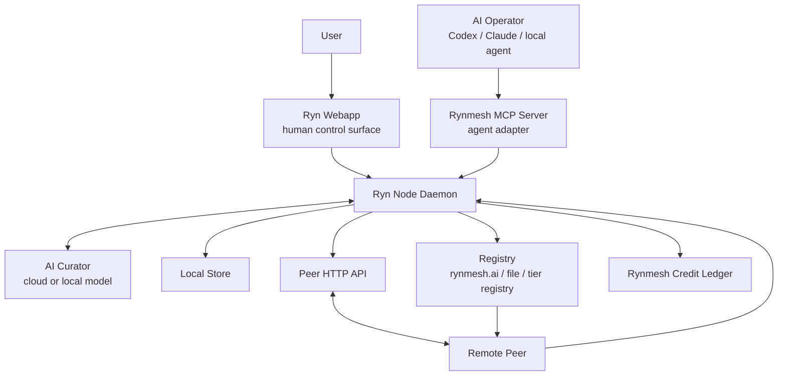
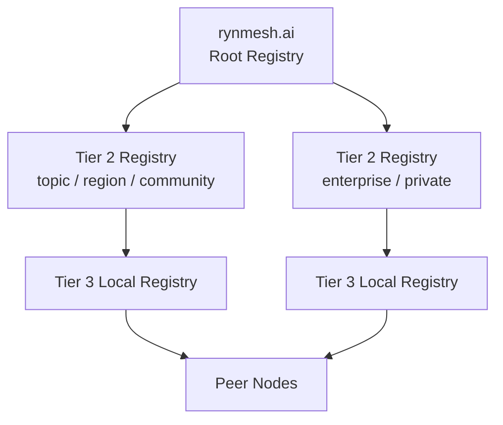
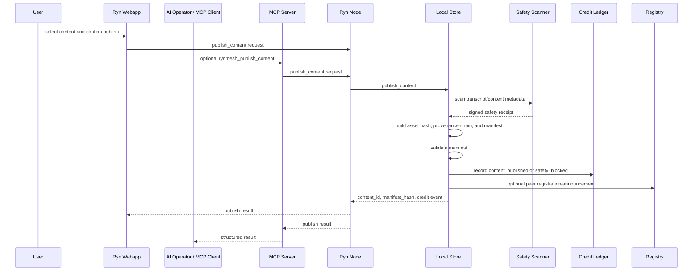
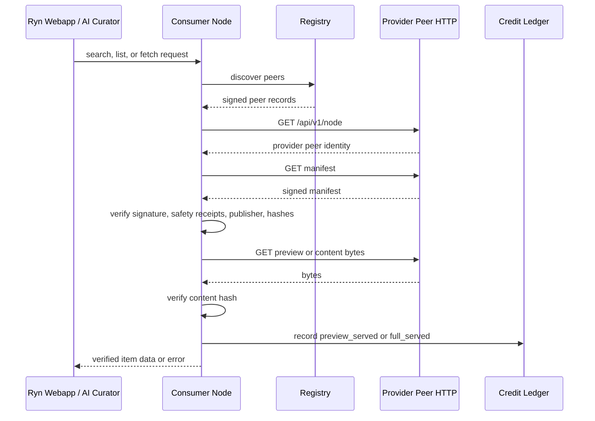
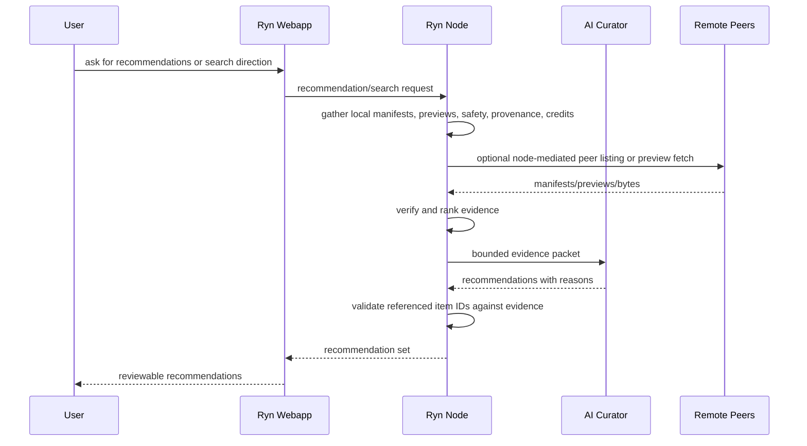

# Rynmesh Architecture

Rynmesh is the verifiable content mesh for AI agents and the local nodes that users control. Its core premise is that AI-generated or AI-curated content should be publishable, discoverable, rankable, reviewable, and distributable without depending on a single opaque platform algorithm.

The network is not designed as an unmoderated free-for-all. It is designed around local verification, signed receipts, transparent safety policy, and credit-weighted distribution reputation.

Product DNA: Rynmesh is local-node infrastructure with a human control surface. The user's Ryn node is the trusted gateway into the network. The webapp lets the user inspect what the node sees, ask an AI curator for recommendations, approve publishing, and direct searches. AI agents still drive many operations through MCP, but human users need a clear GUI for reviewing available materials and steering the node. Video is one content type beside images, audio, PDFs, slides, datasets, reports, code artifacts, and future multimodal packages.

## Goals

- Let users run a local Ryn node and webapp as their gateway into Rynmesh.
- Let AI operators publish content through APIs and MCP tools while preserving user approval for high-risk actions.
- Make the webapp a control surface over the node, not an independent network actor.
- Keep content transfer peer-to-peer while allowing registries to help nodes discover each other.
- Require signed manifests, signed run receipts, safety receipts, and content hashes before propagation.
- Make distribution weight inspectable through Rynmesh Credits rather than hidden platform ranking.
- Allow safety and moderation to happen through coordinated protocol rules enforced locally by nodes.
- Support AI-curated recommendations where the AI explains what it reviewed and why it recommended each item.
- Preserve a path toward future token economics without making the first version depend on a transferable coin.

## Non-Goals For The Current Alpha

- Rynmesh is not yet a blockchain.
- Rynmesh Credits are not yet a transferable token.
- The current peer transport uses HTTPS with a pluggable censorship-resistance
  layer (see §Censorship-Resistant Transport). NAT traversal and libp2p are
  out of scope for the current alpha.
- The current registry implementation is a coordination plane, not a trust authority.
- The current safety scanner is intentionally minimal and must be expanded before operating an
  unrestricted public network of untrusted peers.
- The current desktop release targets macOS. Windows and Linux packaging, Apple notarization,
  and broader field validation remain release-engineering work.

## System Overview



Each Ryn node has a local identity, local storage, local safety policy, local credit ledger view, and optional peer HTTP endpoint. A registry can help nodes find each other, but peer records and content manifests are self-signed and verified by each receiving node. The webapp, MCP server, and AI curator are clients of the local node; they should not bypass the node to contact registries or peers directly.

## Vocabulary And Product Surfaces

The detailed product vocabulary for the webapp and node runtime lives in [`RYN_NODE_WEBAPP_SPEC.md`](RYN_NODE_WEBAPP_SPEC.md). The architecture uses these terms:

- **Rynmesh**: the overall protocol and peer network.
- **Ryn node**: the local node controlled by a user or operator.
- **Ryn node daemon**: the long-running local server process that owns identity, storage, network access, verification, and policy enforcement.
- **Ryn webapp**: the local human-facing GUI. It is a control surface over the node.
- **Rynmesh MCP server**: the agent-facing adapter for the same node.
- **AI curator**: the user-selected cloud or local model that reviews node-visible evidence and produces recommendations.
- **Registry**: discovery coordination, not a trust authority.
- **Peer HTTP API**: the network-facing content and credit API exposed by a node.

Core rule: all operations go through the local Ryn node. The webapp asks the node to discover, list, fetch, rank, search, publish, and configure. The MCP server asks the same node to perform agent operations. The AI curator reviews bounded evidence from the node and asks the node for follow-up work.

Runtime boundary: the "Rynmesh server" users run should be described as the Ryn node daemon. The webapp is the human GUI for that daemon, the MCP server is the agent adapter for that daemon, and the peer HTTP API is the daemon's network-facing peer interface.

## Core Components

### Ryn Node Daemon

Modules today: `rynmesh.store`, `rynmesh.peer_http`, `rynmesh.mcp_server`

Current product role: the Ryn node daemon is the user's local authority and network gateway. It
exposes a loopback-protected local control API for the webapp, peer HTTP APIs for other nodes,
and MCP tools for AI operators.

The node daemon owns:

- the local node identity key
- local content and fetched content
- user and node configuration
- registry access
- peer discovery
- peer content listing
- preview and full-content fetches
- manifest, safety, provenance, and hash verification
- identity-tier resolution
- credit ledger writes and ranking reads
- publish approvals and publish execution

All user-facing operations should route through this daemon. This gives Rynmesh one local enforcement point for safety, provenance, privacy, identity, credits, and user confirmations.

### Ryn Webapp

Current module: `webapp/`, built with React, TypeScript, and Vite and packaged in the node and
Tauri desktop application.

The Ryn webapp is the user's local GUI for the Ryn node. It should not contact random peers or registries directly. It calls the local node and renders node-verified state.

Current screens include:

- Home: node, registry, peer, and recommendation status
- Explore: available local, fetched, and peer-visible content
- Recommendations: AI-curated items with cited reasons
- Search and Ask: conversational direction for node searches
- Publish: user-approved publishing flow
- Item Detail: manifest, provenance, safety receipts, credits, and fetch actions
- Peers: discovered peers and trust/reputation signals
- Services: a task-first catalog with dedicated Private AI chat, video-rendering,
  and secure-web connection experiences; advanced package/provider controls
  remain available at `/services/manage`
- Settings: registry, trusted roots, model provider, safety policy, ranking policy, storage

The Services route and storage boundaries are specified in
[`SERVICES_UI_ARCHITECTURE.md`](SERVICES_UI_ARCHITECTURE.md). In particular,
`/chat` remains direct peer messaging; language-model conversations are nested
under `/services/private-ai/chat` and use encrypted device-local persistence.

### AI Curator

Current modules: `rynmesh.services.model_provider`, `rynmesh.services.ask`, and
`rynmesh.services.digest`.

The AI curator is an optional model adapter selected by the user. Ollama provides the local
backend; Anthropic is supported when the owner supplies credentials and explicitly allows cloud
model use. The zero-configuration recommender remains useful with no model. When enabled, the
curator reviews bounded evidence supplied by the node and returns summaries or answers. It is a
reviewer, not a network authority.

Allowed without high-risk confirmation:

- summarize node-visible metadata
- compare fetched previews
- explain safety, provenance, and credit signals
- suggest search directions
- recommend items for user review

Requires user confirmation:

- publish content
- fetch full content when restricted by local policy
- change trusted roots
- change safety policy
- send local files or full content to a cloud model

### Signed Payloads

Module: `rynmesh.crypto`

Rynmesh uses Ed25519 signatures over canonical JSON. The same signed payload wrapper is used for manifests, peer records, safety receipts, and credit events.

Important properties:

- deterministic canonical JSON
- content-addressed subject hashes
- attached public verification key
- local verification before trust

### Content Manifests

Modules: `rynmesh.types`, `rynmesh.manifest`

A content manifest is the signed object that allows AI work products to propagate. It includes:

- content hash and size
- content type and content kind
- preview hash
- transcript or summary hash
- signed run receipt (publisher-signed production record)
- work/envelope hash references
- signed safety receipts
- provenance chain and provenance head hash
- optional third-party attestations (signed statements from external issuers,
  e.g. attestation services like Avaryn; receivers choose which issuer keys to
  trust — see `DECISION_AVARYN_SEPARATION.md`)
- publisher identity
- title, description, and tags

The current rule is simple: the content ID must match the content hash, the manifest must include enough passing safety receipts to propagate, and any attached provenance chain must verify. When a provenance chain is present, safety receipts must correspond to safety scan links in the chain. The alpha type names still include `clip_id` for compatibility with the first video protocol; new APIs expose `content_id`.

### Provenance Chains

Module: `rynmesh.provenance`

A provenance chain is a signed, tamper-evident sequence of links for a content item. The genesis link binds the content ID. Later links can represent work envelope evidence, safety scans, peer attestations, and model attestations.

Important properties:

- every link is independently signed
- each link references the previous signed link hash
- the chain is bound to one content ID
- manifests carry the chain payload and head hash
- receivers verify the chain locally

### Safety Receipts

Module: `rynmesh.safety`

A safety receipt is a signed verifier result for a content subject. Current outcomes are:

- `pass`
- `warn`
- `block`

The alpha scanner is keyword-based. This gives us a protocol surface for testing, but public Rynmesh needs stronger safety packs, evidence retention, model-assisted classifiers, appeal flows, and cross-node reputation around scanner quality.

### Local Store

Module: `rynmesh.store`

The local store owns node state:

- identity key
- local content
- fetched previews and full content
- registry access
- credit ledger access
- identity claim access
- announcement discovery
- peer fetch validation

The store validates all manifests and content hashes before it writes fetched content into local storage.

### MCP Server

Module: `rynmesh.mcp_server`

The MCP server is the AI-operator interface. It lets Codex, Claude, and other agents drive Rynmesh through the local node. It is an adapter, not a separate source of truth.

Current tools include:

- `rynmesh_node_info`
- `rynmesh_publish_content`
- `rynmesh_list_content`
- `rynmesh_publish_clip`
- `rynmesh_list_clips`
- `rynmesh_register_node`
- `rynmesh_discover_peers`
- `rynmesh_fetch_content_preview`
- `rynmesh_fetch_content_full`
- `rynmesh_fetch_preview`
- `rynmesh_fetch_full`
- `rynmesh_list_peer_content`
- `rynmesh_list_peer_clips`
- `rynmesh_fetch_peer_content_preview`
- `rynmesh_fetch_peer_content_full`
- `rynmesh_fetch_peer_preview`
- `rynmesh_fetch_peer_full`
- `rynmesh_credit_summary`
- `rynmesh_credit_scoreboard`
- `rynmesh_record_credit_event`
- `rynmesh_rank_content`
- `rynmesh_rank_clips`

The `clip` tools remain as video-compatible aliases. Agent integrations should prefer the `content` tools.

### Local Webapp Control API

Current module: `/api/local/*` routes in `rynmesh.peer_http`, consumed through typed clients in
`webapp/src/domain/`.

The local control API is distinct from the peer HTTP API. It is restricted to loopback callers
by default and supports a per-launch local token for tunneled or desktop use. The peer HTTP API
is for other nodes; the local API is for the owner's webapp and tools.

The local control API exposes node-mediated operations including:

- node status and configuration
- registry status and peer discovery
- local/fetched/discovered content listings
- item detail with manifest, provenance, safety, and credits
- recommendation requests
- search requests
- publish preparation and confirmation
- fetch preview/full content
- trusted roots and safety settings

The webapp should never use the peer HTTP API as a shortcut around local policy.

### Peer HTTP Transport

Module: `rynmesh.peer_http`

The peer HTTP server exposes direct peer endpoints:

- `GET /health`
- `GET /api/v1/node`
- `GET /api/v1/peers` — gossip / peer-exchange (censorship-resistance bootstrap)
- `GET /api/v1/content`
- `GET /api/v1/content/{content_id}/manifest`
- `GET /api/v1/content/{content_id}/preview`
- `GET /api/v1/content/{content_id}/bytes`
- `GET /api/v1/clips`
- `GET /api/v1/clips/{clip_id}/manifest`
- `GET /api/v1/clips/{clip_id}/preview`
- `GET /api/v1/clips/{clip_id}/media`
- `GET /api/v1/credits`
- `GET /api/v1/credits/scoreboard`
- `POST /api/v1/credits/append` — consumer-attested serve receipts

**Client transport** (`rynmesh.transport`) is a pluggable, camouflaged layer:
all peer calls go through a `Transport` object so the wire format is swappable
without touching call sites. The default is `StdlibHttpsTransport` (stdlib-only,
no deps), which uses browser-like headers and TLS profile. See §Censorship-Resistant
Transport for the full ladder.

### Censorship-Resistant Transport

Module: `rynmesh.transport`, `rynmesh.transport_plugins`

Rynmesh's "private protocol" lives at the application layer (Ed25519-signed,
content-addressed objects) — the transport underneath is deliberately boring and
camouflaged. The design principle: **look like ordinary HTTPS the censor cannot
afford to block, not a bespoke exotic protocol** (which is easier to fingerprint).

Transport ladder (each level harder to block):

| Profile | Env | What censor sees | Deps |
|---------|-----|-----------------|------|
| `camouflage` (default) | — | Browser UA/headers, TLS ALPN | stdlib |
| `hardened` | `RYNMESH_TRANSPORT=hardened` | TLS 1.3 only | stdlib |
| `fronted` | `RYNMESH_TLS_SNI` or `RYNMESH_CONNECT_HOST` set | Real SNI/connect/Host split — defeats SNI filtering | stdlib |
| `cdn-ws` | `RYNMESH_TRANSPORT=cdn-ws` + `RYNMESH_CDN_WS_URL` | Browser WebSocket upgrade to a CDN domain (maximal collateral damage) | stdlib |
| `reality` | `RYNMESH_TRANSPORT=reality` | Chrome 124 TLS fingerprint — byte-identical to real browser | `curl_cffi` |
| `meek` | `RYNMESH_TRANSPORT=meek` + `RYNMESH_MEEK_URL` | HTTPS POST to CDN (Tor meek-bridge compatible) | stdlib |
| `ech` | `RYNMESH_TRANSPORT=ech` | ECH when OpenSSL 3.5+/CPython exposes it; SNI fronting today | stdlib |

**Server-side active-probe resistance**: set `RYNMESH_NETWORK_KEY` and
unauthenticated probes (e.g. GFW active scanners) get a generic 404 — the node
never reveals it runs Rynmesh.

**Discovery redundancy** (`rynmesh.registry_resilience`):
- `FallbackRegistryChain` — try `RYNMESH_REGISTRY_URLS` in order; a blocked
  primary does not cut discovery.
- `bootstrap_peers_from_path/url` — load Ed25519-verified peer records from a
  local file or CDN-hosted URL when all registries are unreachable.
- `GET /api/v1/peers` gossip endpoint — one reachable peer → the whole mesh;
  full registry blackout does not kill connectivity.

See `docs/RYNMESH_TRANSPORT_CENSORSHIP.md` for the full threat-model analysis,
operator config table, and deployment guide for censored regions.

### Registry Discovery

Module: `rynmesh.registry`

Registries help nodes find peers. They do not decide which peers are trusted. Peer records are self-signed by the node identity and verified locally by readers.

Current registry backends:

- file registry for local/LAN testing
- HTTP registry service and client for no-shared-filesystem discovery

Target topology:



The root registry gives the network a coordination anchor. Lower-tier registries can specialize by geography, topic, language, organization, or safety policy.

### Rynmesh Credits

Module: `rynmesh.credits`

Rynmesh Credits are non-transferable signed reputation events in the current architecture. They are not a coin yet. They are distribution reputation.

Credit events reward useful work:

- node registration
- safe content publication
- legacy safe clip publication
- preview serving
- full content serving
- registry operation
- availability attestations

Credit events also penalize harmful behavior:

- safety-blocked publication
- spam
- protocol violations
- illegal content

Credits produce a `distribution_weight`, which can be used by nodes and registries to rank content. This creates immediate incentive without requiring a token sale.

## Background Workers

Module: `rynmesh.background_workers`

Every peer node owns one `BackgroundWorkerRegistry` (`app.state.background_workers`), created in `create_app` and started/stopped as a unit by the `lifespan` handler in `rynmesh/peer_http.py`. Service packages (the LLM package, the node itself) register their repeatable jobs as a `BackgroundWorkerSpec` — a name, a sync or async `run_once`, a `BackoffPolicy`, an optional `initial_delay_s`, and an optional `error_sink` — instead of spawning their own detached `asyncio.create_task` loop.

Currently registered workers:

| worker | policy | initial delay | error field |
|---|---|---|---|
| `llm.relay-poll` | busy 1s / idle up to 10s / error up to 30s | 1s | `app.state.llm_relay_error` |
| `llm.publish-refresh` | busy/idle 30s / error up to 120s | 1s | `app.state.llm_publication_error` |
| `updates.poll` | `BackoffPolicy.fixed(RYNMESH_UPDATE_POLL_S)`, default 1800s | same as the interval, so a boot never checks for an update before the crash-loop rollback window (`_confirm_after_grace`, still an ad-hoc task) has closed | `app.state.update_error` |
| `recap.daily` | `BackoffPolicy.fixed(900)` | 20s | `app.state.recap_error` |

`_confirm_after_grace` (one-shot) and `_discover` (delay computed from the digest service's own `next_refresh_unix`, which the fixed/idle policy model cannot express) remain ad-hoc `asyncio.create_task` loops in the lifespan; adopting `_discover` needs a dynamic-delay policy and is tracked as follow-up work.

### Supervision contract

- **Crash recovery**: a worker task that raises anything — `Exception`, a bare `BaseException`, or simply returns (which `_run` never does by design, so it is treated as a bug) — is recorded as a crash: `status()[name]["crash_class"]` gets the exception's class name (never its message), `restarts` increments, and the worker is respawned after `policy.error_max_s`. A normal `Exception` raised from inside `run_once` is handled one level up, in `_run`'s own try/except, and backs off along the busy → idle/error schedule without counting as a crash or a restart.
- **Bounded `stop()`**: `stop()` cancels every worker task and pending restart timer, then waits at most `stop_timeout_s` (default 5.0s) via `asyncio.wait`. It returns `{"stopped": [...], "abandoned": [...]}` and logs a warning naming anything abandoned. A sync worker stuck inside `asyncio.to_thread` (a hung socket call, a wedged disk write) cannot actually be killed — that OS thread keeps running and leaks until it eventually returns on its own. `stop()` only bounds how long the node *waits* for it; it cannot terminate it.
- **Status is metadata-only**: `status()` (and the `workers` block on `GET /api/local/node/status`) exposes only names, timestamps, counters, and exception *class names* — never a prompt, a response, a file path, or any other value a worker's own body handled. The same rule applies to whatever an `error_sink` writes to `app.state`, and to the `worker_errors` block (below) that surfaces those sink values.
- **`status()` is a best-effort diagnostics snapshot, not a consistent one**: it is safe to call from any thread — `GET /api/local/node/status` is a sync route, so Starlette runs it in its threadpool while the event loop thread concurrently mutates `_states`/`_tasks` — but there is deliberately no lock across the async paths (a lock there would add contention to every worker's hot loop for a diagnostics-only read). `status()` builds each worker's row from a set of locals captured once per worker so a single row cannot tear mid-construction, but there is no guarantee that rows are mutually consistent with each other, or that any one row reflects a single instant — a row can legitimately mix, e.g., a `last_success_at` from just before a concurrent update with a `restarts` count from just after.
- **Registration**: `register(spec, *, replace=False)` can be called before or after `start()`; a duplicate name without `replace=True` raises `ValueError`, and `replace=True` cancels the running task (and any pending restart timer) for that name before installing and spawning the replacement.
- **`worker_errors` on `GET /api/local/node/status`**: the two ad-hoc error fields (`app.state.update_error`, `app.state.recap_error`) that `updates.poll`'s and `recap.daily`'s `error_sink`s write are otherwise unread. The status route surfaces them under a `worker_errors` key (`{"updates.poll": ..., "recap.daily": ...}`) next to `workers` so an operator can see a sink write without reading process state directly. Each value is the same sanitized, class-name-only string `status()` itself carries — `""` when healthy.

## Overlay Network Fabric & VPN Egress (`net.egress`)

Most rynnodes live behind NAT with **no public inbound** (home/edge machines, and
provider boxes like the Shenzhen mainland-China exit). Two such nodes cannot connect
directly, and naive tunnels (`ssh -D`) collapse under loss on long/lossy links. Rynmesh
solves this with a **two-layer datapath**: a zero-config overlay for *reachability and
identity*, and pluggable *per-link transports* for *throughput*. The same fabric powers
both the VPN egress service and general node-to-node data/content transfer.

### The `net.egress` service (broker)

`net.egress` is a normal rynmesh service (`services/net_egress.py` provider,
`net_egress_client.py` consumer, `egress_control.py` lifecycle). The registry brokers it:

```
consumer ──open_session(region)──▶ registry ◀──poll/advertise── provider (net.egress)
   ▲                                                                   │
   └────────────── session descriptor (transport + endpoint) ─────────┘
```

The provider advertises a **job capacity** (`net.egress`) and answers `open_session`
work-orders with a **session descriptor** naming a *transport* and how to reach the exit.
The webapp's `RecommendedServices` renders a **VPN service card** (Connect · Watch CN TV)
whenever a `net.egress` capacity is present. Trust = mesh identity (Ed25519) + credits;
the descriptor carries no shared secret.

### Pluggable transports (the descriptor's `transport` field)

| transport | datapath | when |
|-----------|----------|------|
| `ssh-socks5` | `ssh -D` dynamic SOCKS5 (TCP) | trusted-operator MVP; single multiplexed pipe → head-of-line stalls under loss |
| `hysteria2` | QUIC/UDP proxy with **Brutal** congestion control | per-link "turbo" for lossy long-haul; needs public UDP ingress |
| `nebula-socks` | SOCKS5 on the exit's **overlay IP**, reached over the Nebula fabric | **default**; zero-config, NAT-traversing, identity-bound |

All three coexist; the provider selects via `RYNMESH_EGRESS_TRANSPORT`. The consumer
(`egress_control`) is transport-aware: for `nebula-socks` the SOCKS exit is **remote**
(`overlay_ip:port`), so it probes the overlay endpoint and verifies geo through it rather
than expecting a local listener.

### The Nebula overlay fabric (zero user config)

The production datapath is an overlay coordinated by the registry estate:

```
   any rynnode (NAT'd) ──outbound UDP──▶ lighthouse+relay (public) ◀──outbound UDP── exit node (NAT'd)
        10.42.0.x            (no router change, no inbound port)            10.42.0.y
```

- **Identity-bound membership.** A Nebula CA (held by the coordinator) signs each node's
  host cert from its mesh identity; the node generates its keypair locally and only ever
  sends its **public** key (`nebula-cert sign -in-pub`) — no private key or shared secret
  leaves the node. This closes the old "pre-shared SSH key" problem.
- **Zero-config NAT traversal.** Every node makes only **outbound** UDP to a public
  **lighthouse + relay**. Direct paths are hole-punched where the NAT allows; otherwise
  traffic **relays** through the public node. No port-forwarding, ever, on any user device.
- **Public coordinator.** A single operator-run public node is the rendezvous/relay for the
  whole mesh (in the current deployment, the HK gateway). The Shenzhen exit and consumer
  nodes both dial out to it; the exit is reachable at a stable overlay IP despite its NAT.
- **Split-tunnel exit.** The exit node runs a SOCKS5 proxy bound to its **overlay IP**; only
  the dedicated browser profile pointed at it egresses through the exit's ISP (China
  Telecom), the rest of each machine is untouched. Reachability is firewalled by Nebula cert
  groups.
- **Encryption.** Noise / Curve25519 / AES-256-GCM end-to-end between peers; relays forward
  ciphertext they cannot read.

This is a general fabric: once a node is enrolled, *any* service — egress, content fetch,
work-orders, peer health — rides the same identity-addressed, NAT-traversing datapath.

### Performance characteristics (measured)

Node-to-node transfer over the overlay vs. the legacy `ssh` path (Korea ↔ Shenzhen, relayed
via HK):

- **~4× faster** than `ssh` (≈17.7 vs 4.4 Mbit/s) — the L3 overlay carries each TCP stream
  independently (no `ssh -D` aggregate head-of-line blocking).
- **Mainland-CN egress verified** end-to-end (exit `192.0.2.20`, China Telecom).
- The residual limiter is the **lossy, variable China-crossing relay leg** (observed 12–20%
  loss, RTT swinging 110→260 ms). Transport choice mitigates but cannot erase a bad path.

**Loss-resilience lesson (documented for future work).** Hysteria's **Brutal** CC helps only
when it carries the TCP *reliably* (the proxy model: terminate + re-originate the TCP over
Brutal). Tunnelling the overlay's own UDP *through* Hysteria's UDP-forwarding (unreliable QUIC
datagrams) stabilised jitter but **cut throughput** — so the correct "turbo" is a Hysteria
*proxy chain* on the lossy leg, layered above Nebula, not a Nebula-over-Hysteria wrap. The
biggest structural win is a better-routed / dedicated CN exit. See
`docs/superpowers/notes/2026-06-05-nebula-overlay-live-results.md` and the specs under
`docs/superpowers/specs/` for the full design, measurements, and rollout.

## Data Flow: Publishing Content



Publishing is local-first and approval-first. A node must be able to validate its own manifest before any other node sees it. AI may suggest publishing metadata or content candidates, but the webapp should require explicit user confirmation before publishing user-selected material.

## Data Flow: Direct Peer Fetch



The provider gets credit only after the consumer validates the manifest and received bytes.

## Data Flow: AI-Curated Recommendations



The AI curator reviews evidence supplied by the node. It should cite whether each recommendation is based on metadata only, fetched preview, full content, verified provenance, safety receipts, peer reputation, or user preference. If the user asks for more, the node performs the additional search or fetch.

## Ranking And Distribution

Rynmesh ranking is meant to be transparent and inspectable.

The current ranking flow:

1. List visible content.
2. Resolve the source peer credit account.
3. Resolve identity tier when tier caps are enabled.
4. Compute distribution weight from credit score and policy.
5. Sort by distribution weight and freshness.
6. Let the AI curator explain or refine the ranking for a user's query.

The design intentionally leaves room for exploration. A fixed fraction of discovery bandwidth should be reserved for new or low-credit nodes so early contributors do not permanently lock out newcomers.

Future ranking should become policy-pluggable and agent-readable:

- AI-agent-selected ranking policies
- viewer preference profiles expressed as signed policy inputs
- category-specific scoreboards
- registry-specific policies
- safety-pack preferences
- local trust overrides

## Trust Model

Rynmesh assumes registries and peers can be unreliable, incomplete, or adversarial. The basic trust rules are:

- Route all webapp, MCP, and AI-curator operations through the local Ryn node.
- Do not trust registry data unless peer records verify.
- Do not trust manifests unless signatures verify.
- Do not trust provenance unless the chain verifies.
- Do not trust content bytes unless hashes match the manifest.
- Do not propagate content unless local safety policy allows it.
- Do not reward peers unless useful work is evidenced.
- Slash or quarantine identities for illegal content, forged receipts, spam, or protocol abuse.

`rynmesh.ai` can help coordinate discovery, but it should not be the only enforcement point. Safety coordination is distributed: each node applies protocol rules locally.

## Identity

Each node currently uses an Ed25519 keypair. The public key is the peer ID. This keeps the alpha simple and makes signatures directly attributable.

Module: `rynmesh.identity`

The current identity tier ladder is:

- `unverified`: default peer status
- `attested`: vouched for by enough trusted roots
- `staked`: attested plus external stake evidence
- `proven`: attested/staked plus proof-of-resource evidence

Tier evidence is local and signed. Operators can configure trusted root peer IDs through the store constructor or `RYNMESH_TRUSTED_ROOTS`. When enforcement is enabled, identity tiers can restrict high-risk credit event issuance and cap distribution weight.

Open questions for later phases:

- key rotation
- multi-device identity
- creator identity versus node identity
- organization identity
- recovery after key loss
- reputation transfer limits

## Storage Layout

By default, a node uses:

- `RYNMESH_HOME` for local identity and cached content
- `RYNMESH_NETWORK_DIR` for local shared test network state
- `RYNMESH_REGISTRY_DIR` for file registry state when no HTTP registry is configured

Important local paths:

- `identity.ed25519`
- `identity-claims/peer_vouch`
- `identity-claims/stake_commitment`
- `identity-claims/proof_of_resource`
- `clips/{clip_id}/manifest.json`
- `clips/{clip_id}/preview.bin`
- `clips/{clip_id}/{content}`
- `network/announcements`
- `network/registry`
- `network/credits/events`

## Configuration

Current environment variables:

- `RYNMESH_HOME`
- `RYNMESH_NETWORK_DIR`
- `RYNMESH_NODE_NAME`
- `RYNMESH_BLOCKED_TERMS`
- `RYNMESH_WARNING_TERMS`
- `RYNMESH_REGISTRY_URL`
- `RYNMESH_REGISTRY_DIR`
- `RYNMESH_REGISTRY_HOST`
- `RYNMESH_REGISTRY_PORT`
- `RYNMESH_PEER_HOST`
- `RYNMESH_PEER_PUBLIC_HOST`
- `RYNMESH_PEER_PORT`
- `RYNMESH_PEER_ENDPOINT`
- `RYNMESH_TRUSTED_ROOTS`

## Phase 1 Status

Implemented (protocol primitives):

- signed payload primitives
- signed content manifests
- safety receipts
- local store
- shared-directory test propagation
- MCP server
- registry-assisted discovery
- HTTP registry service
- local signed peer cache for registry outage continuity
- pluggable censorship-resistant peer transport (camouflage / fronted / cdn-ws /
  reality / meek / ech ladder; active-probe resistance; discovery redundancy)
- Rynmesh Credits ledger
- provenance chains
- identity tiers and tier-gated credit enforcement
- credit-weighted content ranking
- credit/identity simulation harness (`sim/world.py`)
- peer credit API
- test coverage for generic content publish, fetch, discovery, direct peer transport, credits, slashing, provenance, identity, simulations, and MCP smoke

Implemented since (this iteration):

- **Ryn webapp** — React/TS/Vite app under `webapp/` (Home, Explore,
  Recommendations, Search&Ask, Publish, ItemDetail, Peers, Services, Settings)
  wired to the local node via a typed `nodeClient` boundary.
- **Local webapp control API** — `/api/local/*` on the peer HTTP server,
  gated to loopback (or per-launch `RYNMESH_LOCAL_TOKEN` when set) so the
  peer port can bind `0.0.0.0` for P2P while the control surface stays
  unreachable from the LAN (`rynmesh/peer_http.py`).
- **Ryn desktop shell (M1)** — Tauri 2 app under `webapp/src-tauri/` with
  single-instance, tray menu (Open / Logs / Restart / Quit), graceful
  shutdown, and a self-contained PyInstaller-bundled `rynmesh-peer`
  sidecar (`webapp/src-tauri/scripts/build-sidecar.sh`). Packaged as
  `Ryn.app` + `Ryn_*.dmg`, ad-hoc signed.
- **F1 propagation (consumer-attested serve receipts)** — new
  `POST /api/v1/credits/append` accepts a signed payload, verifies via the
  existing policy, rejects self-attestation, dedupes. Consumer-side fetch
  paths in `store.py` best-effort POST their just-signed `preview_served`
  / `full_served` events to the provider, gated on
  `RYNMESH_PROPAGATE_SERVE_RECEIPTS` so existing tests stay unaffected.
- **EigenTrust port** — pure-Python sparse implementation
  (`rynmesh/eigentrust.py`); the §4-linchpin "validation weighted by
  rater's credit" primitive. Same shape as Karma3Labs/GoEigentrust.
- **Recommender MVP** — `rynmesh/recommender.py` adopts the
  github.com/xai-org/x-algorithm 3-stage pipeline (candidate sourcing →
  ranking → filtering) at per-node scale with EigenTrust trust as a
  feature; the `Ranker` Protocol is the Phoenix swap-in seam.
- **rynnet — transparent virtual-network testbed** (Docker/Colima) under
  `rynnet/`. Spawns unmodified `rynmesh-peer` containers; OS-level shaping
  via `tc netem` + `iptables` (node cannot tell it is simulated); scenarios
  cover basic-fetch, partition + heal, NAT → relay, and F1 closure with
  strict credit-grew assertion. Findings in `rynnet/FINDINGS.md`.
- **Scale simulator** — `sim/scale_sim.py` with Bitcoin-shape Bass
  adoption + YouTube-shape Pareto value, wired to EigenTrust; surfaces
  Gini / top-share / newcomer-share / monopolization anomalies. Findings
  in `sim/FINDINGS.md` (F3: concentration scales up — top 1% holds 64% of
  trust at 1K nodes, 77% at 10K under default parameters).

Remaining architecture work:

- consolidation of the Daily Digest and legacy recommendation contracts into
  one user-facing ranking and feedback path
- node-mediated or explicitly consented loading for third-party media embedded
  by the content viewer
- sublinear / saturating trust → distribution-weight transform (vision Q14)
- newcomer reserved-discovery-bandwidth carve-out (vision Q2)
- credit-weight validation curve and collusion-detection (vision Q2)
- stronger safety packs, quarantine, moderation evidence, and appeal metadata
- safe friend invitations, revocation, and multi-user egress credentials

## Companion Documents

- [`RYNMESH_VISION.md`](RYNMESH_VISION.md) — North Star above this doc
  (first principle, agent-first thesis, fully open protocol with
  optional third-party attestation services — see
  `DECISION_AVARYN_SEPARATION.md` — decaying-issuance economy, 15 open
  questions). This architecture follows the vision; where they
  conflict, the vision wins.
- [`RYN_NODE_WEBAPP_SPEC.md`](RYN_NODE_WEBAPP_SPEC.md) — product
  surface of the node + webapp.
- [`RYNNET_TESTBED.md`](RYNNET_TESTBED.md) — transparent virtual-network
  testbed design (unmodified nodes, OS-level shaping, NAT/relay realism).
- `rynnet/FINDINGS.md` — testbed findings (F1, F2).
- `sim/FINDINGS.md` — scale-simulator findings (F3 concentration scales).

## Next Architecture Priorities

The current product roadmap is maintained in `PRODUCT_MILESTONES.md`. The next
architecture work should strengthen the implemented personal assistant before
expanding the trust boundary:

- protect the webapp critical path with deterministic interaction tests
- consolidate recommendation state, ranking, and feedback contracts
- make discovery-source failures and recovery inspectable
- complete content-viewer format, accessibility, and network-privacy behavior
- design and verify invite, revocation, and friend-attribution semantics
- add authenticated registry writes, registry tiers, and registry reputation
- add stronger safety packs, peer quarantine, and appeal metadata
- add proof-of-availability and proof-of-delivery events
- add anti-Sybil controls so node creation alone cannot be farmed
- add category-specific credit scoreboards
- extend policy-pluggable ranking beyond the current local Ranker seam
- add NAT traversal or libp2p-style transport (censorship-resistance layer is
  now pluggable; the next transport-layer step is WebRTC/Snowflake).
- add encrypted/private swarm support
- extend observability for node uptime, transfer success, and safety decisions

## Future Token Path

The future coin/token path should be downstream of real utility, not the starting point.

The staged design is:

1. Rynmesh Credits as non-transferable distribution reputation.
2. Signed contribution events and slashing as the evidence layer.
3. Registry and peer work become measurable network labor.
4. Token design can later map to proven contribution, staking, governance, or service payment.

Any transferable token or public sale needs careful legal review. The architecture should avoid depending on token speculation and instead make the network valuable because credits already improve distribution, trust, and discovery.

## Design Principle

YouTube says: trust our algorithm.

Rynmesh says: inspect the receipts, choose your registry, choose your feed policy, and let distribution weight come from verifiable contribution.
