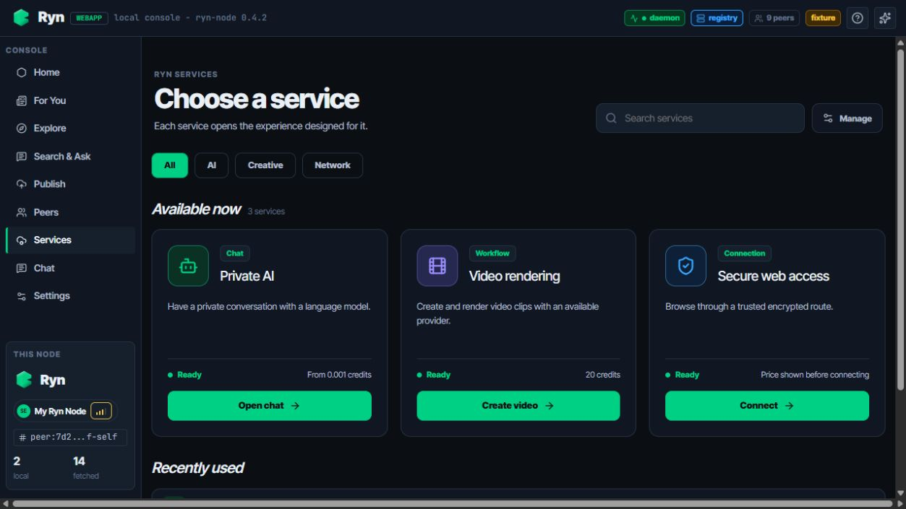
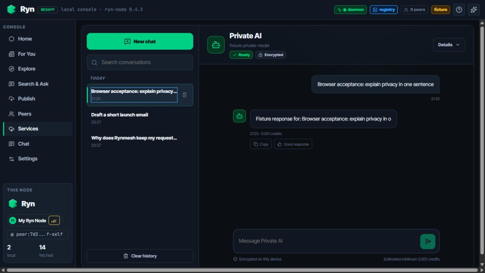
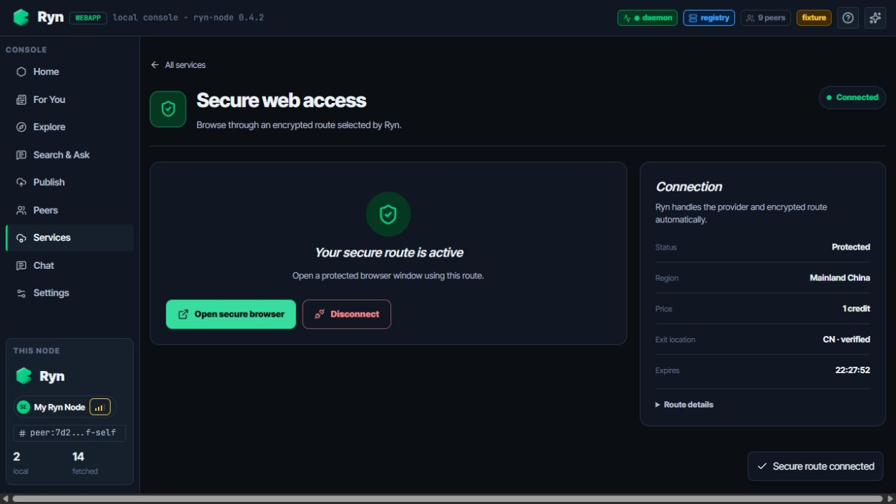

# Services UI browser acceptance

Date: 2026-08-25

Branch: `feature/local-llm-dual-node`

Environment: Vite development server with `client=fixture`

Scope: browser-level UI and interaction acceptance. Fixture mode exercises the
same React routes and typed client contracts with deterministic responses; it
does not claim live provider, public P2P, or production egress connectivity.

## Acceptance results

- Services catalog: all three service cards rendered; search narrowed the list to Private AI.
- Private AI: created a new conversation, received a response, switched to an older conversation, and filtered conversation history.
- Video rendering: submitted `boss-approval-video-001` with three scenes and received the submitted state.
- Secure web access: connected, verified the CN exit state and displayed price, launched the secure browser action, then disconnected.

## Reproduce

```bash
cd webapp
npm ci
npm run dev -- --host 127.0.0.1 --port 5173
```

Open `http://127.0.0.1:5173/services?client=fixture` and repeat the four flows
above. Automated coverage lives in:

- `webapp/src/screens/ServicesCatalog.test.tsx`
- `webapp/src/screens/PrivateAIChat.test.tsx`
- `webapp/src/screens/ServiceExperiences.test.tsx`
- `webapp/src/domain/llmConversationStore.test.ts`

Automated checks at this acceptance point:

- `npm run lint` passed;
- `npm test` passed all 38 tests;
- `npm run build` produced the Vite production bundle.

## Screenshots

### 1. Services catalog



### 2. Private AI multi-session chat



### 3. Video render submitted


### 4. Secure web connected


